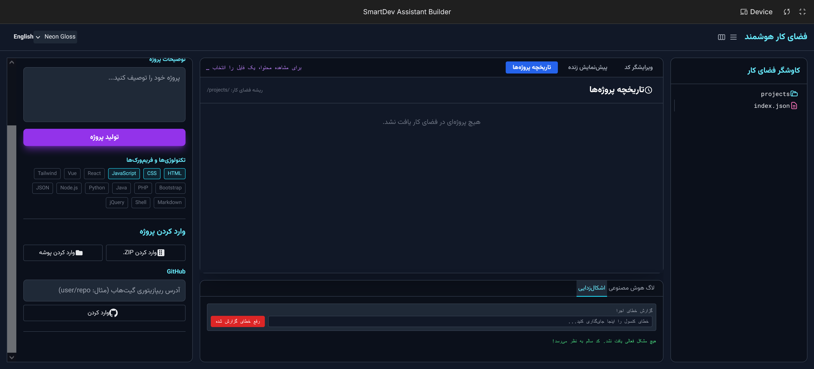

# SmartDev Assistant Builder / دستیار هوشمند برنامه‌نویسی



## 🇬🇧 English Documentation

**SmartDev Assistant Builder** is a powerful, AI-driven development environment that allows you to generate, edit, preview, and debug web applications entirely in your browser. Powered by Google Gemini AI.

### 🚀 Capabilities: What can you build?
- **Single Page Applications (SPAs):** React, Vue, or Vanilla JS apps.
- **Landing Pages:** Marketing sites with Tailwind CSS or Bootstrap.
- **Tools & Utilities:** Calculators, To-Do lists, Converters.
- **Prototypes:** Rapidly visualize ideas before full-scale development.
- **Learning Projects:** Experiment with HTML/CSS/JS with instant AI feedback.

---

### 🔑 API Key Setup
To use the AI features (Code Generation, Debugging, Auto-Fix), you need a **Google Gemini API Key**.

1.  **Get Key:** Visit [Google AI Studio](https://aistudio.google.com/app/apikey).
2.  **Create Key:** Click "Create API Key" (it's free for most use cases).
3.  **Use in App:** The app automatically uses the environment variable provided by the platform. If running locally, create a `.env` file with `API_KEY=your_key_here`.

---

### 🛠 Tools Required (For Local Development)
If you want to run this *Builder* itself on your machine:

*   [**Node.js**](https://nodejs.org/): Runtime environment (LTS version recommended).
*   [**VS Code**](https://code.visualstudio.com/): Recommended code editor.
*   [**Git**](https://git-scm.com/): Version control.

---

### 📦 Installation & Deployment Guide

#### 1. Local Installation
To run a generated project on your computer:
1.  Click **"Download .ZIP"** in the app.
2.  Extract the zip file.
3.  Open the folder in VS Code.
4.  If it's a static site (HTML/CSS/JS), just open `index.html`.
5.  If it uses Node.js/React:
    ```bash
    npm install
    npm run dev
    ```

#### 2. Deploy to GitHub Pages (Free)
1.  Create a repository on [GitHub](https://github.com/new).
2.  Push your generated code to the repo.
3.  Go to **Settings > Pages**.
4.  Select the `main` branch and `root` folder.
5.  Save. Your site will be live in minutes.

#### 3. Deploy to Cloudflare Pages (Free & Fast)
1.  Sign up for [Cloudflare Pages](https://pages.cloudflare.com/).
2.  Connect your GitHub account.
3.  Select your repository.
4.  **Build Settings:**
    *   For static HTML: Leave blank.
    *   For React/Vite: Command: `npm run build`, Output: `dist`.
5.  Click **Deploy**.

#### 4. Shared Hosting (cPanel/DirectAdmin)
1.  Download the project ZIP.
2.  Log in to your hosting File Manager.
3.  Upload the ZIP to `public_html`.
4.  Extract it.
5.  Ensure `index.html` is in the root of `public_html`.

---

## 🇮🇷 راهنمای فارسی

**SmartDev Assistant Builder** یک محیط توسعه قدرتمند مبتنی بر هوش مصنوعی است که به شما امکان می‌دهد برنامه‌های تحت وب را مستقیماً در مرورگر خود تولید، ویرایش، پیش‌نمایش و دیباگ کنید.

### 🚀 چه چیزی می‌توان ساخت؟
*   **اپلیکیشن‌های تک‌صفحه‌ای (SPA):** با React، Vue یا جاوا اسکریپت خالص.
*   **صفحات فرود (Landing Pages):** سایت‌های تبلیغاتی با Tailwind CSS یا Bootstrap.
*   **ابزارها:** ماشین حساب، لیست وظایف، مبدل‌ها.
*   **پروتوتایپ‌ها:** ایده‌های خود را قبل از توسعه نهایی به سرعت مشاهده کنید.

---

### 🔑 راهنمای دریافت کلید API
برای استفاده از قابلیت‌های هوش مصنوعی، به یک **کلید API گوگل جمینای** نیاز دارید.

1.  **دریافت کلید:** به سایت [Google AI Studio](https://aistudio.google.com/app/apikey) بروید (ممکن است نیاز به تغییر IP داشته باشید).
2.  **ساخت کلید:** روی دکمه "Create API Key" کلیک کنید.
3.  **استفاده:** این برنامه به صورت خودکار از کلید محیطی استفاده می‌کند.

---

### 📦 راهنمای نصب و راه‌اندازی

#### ۱. نصب لوکال (روی کامپیوتر خودتان)
1.  دکمه **"Download .ZIP"** را بزنید و فایل را دانلود کنید.
2.  فایل را اکسترکت کنید.
3.  اگر سایت ساده HTML است، فایل `index.html` را باز کنید.
4.  اگر پروژه Node.js/React است:
    *   [Node.js](https://nodejs.org/) را نصب کنید.
    *   در ترمینال پوشه دستور `npm install` و سپس `npm run dev` را بزنید.

#### ۲. آپلود روی هاست اشتراکی (cPanel)
1.  فایل‌های پروژه را دانلود کنید.
2.  وارد File Manager هاست شوید.
3.  فایل‌ها را در پوشه `public_html` آپلود کنید.
4.  مطمئن شوید فایل `index.html` در صفحه اصلی باشد.

#### ۳. دیپلوی روی گیت‌هاب (GitHub Pages)
1.  در [GitHub](https://github.com/) یک ریپازیتوری جدید بسازید.
2.  کدهای خود را آپلود کنید.
3.  به بخش **Settings > Pages** بروید.
4.  شاخه `main` را انتخاب کرده و ذخیره کنید.

#### ۴. استفاده از Cloudflare Pages (پیشنهادی)
1.  در [Cloudflare](https://pages.cloudflare.com/) ثبت نام کنید.
2.  حساب گیت‌هاب خود را متصل کنید.
3.  پروژه را انتخاب کرده و دکمه Deploy را بزنید.

---

*(Screenshots placeholder folder created at /images)*
